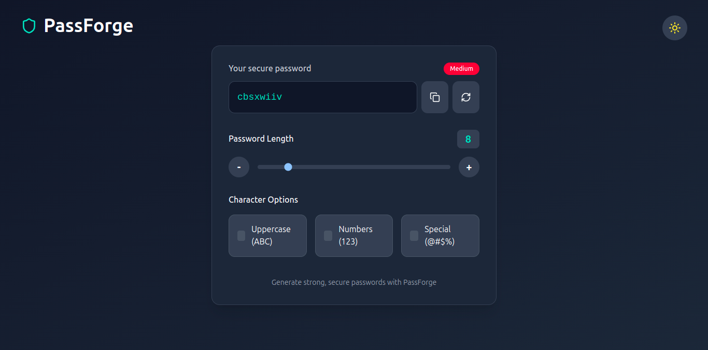

# PassForge - Modern Password Generator


PassForge is a modern, responsive password generator built with React and styled with Tailwind CSS. It allows users to create secure, customizable passwords with various character options and features an elegant dark/light theme toggle.

## ✨ Features

- **Customizable Password Generation**: Adjust length and character types
- **Dark/Light Theme**: Automatic system preference detection with manual toggle
- **Password Strength Indicator**: Visual feedback on password security
- **Copy to Clipboard**: One-click copying with toast notification
- **Responsive Design**: Works on all device sizes
- **Modern UI**: Clean, intuitive interface with smooth transitions

## 🖼️ Screenshots

<div align="center" style="display: flex; flex-wrap: wrap; justify-content: center; gap: 10px; margin: 20px 0;">
  
</div>


## 🚀 Installation

1. Clone the repository:

```bash
git clone https://github.com/yourusername/passforge.git
cd passforge
```

2. Install dependencies:
```bash
npm install
```

3. Start the development server:
```bash
npm start
```

## 💻 Usage

1. Adjust the password length using the slider or +/- buttons
2. Select character options (uppercase, numbers, special characters)
3. Click the copy button to copy the password to clipboard
4. Toggle between light and dark themes using the theme button


## 🤝 Contributing

Contributions are welcome! Please feel free to submit a Pull Request.


## 🙏 Acknowledgements

- [React](https://reactjs.org/)
- [Tailwind CSS](https://tailwindcss.com/)
- [Lucide Icons](https://lucide.dev/)
- [React Hot Toast](https://react-hot-toast.com/)

---

Made with ❤️ by Harsh K
